# Design Document: Website Vulnerability Scanner (SA/SD DFD Model)

> **Data Flow Diagram (DFD) Model & System Architecture**  
> **Methodology**: Structured Analysis & Structured Design (SA/SD)  
> **Target Project**: Automated Web Application Vulnerability Scanner

> **Design authority.** This document derives its requirements from
> [SRS v1.2](../srs/SRS.md). It explains the approved design and must be
> updated when the canonical SRS changes; it does not override the SRS.

**Prepared by**:
- **Deepthi K (241IT021)**
- **Jasmine (241IT051)**
- **Sacheth Koushal (241IT058)**

**DEPARTMENT OF INFORMATION TECHNOLOGY**  
**NATIONAL INSTITUTE OF TECHNOLOGY KARNATAKA, SURATHKAL**

---

## Table of Contents

1. [Data Flow Diagram (DFD) Model](#1-data-flow-diagram-dfd-model)
   - [1.1 Level 0 DFD (Context Diagram)](#11-level-0-dfd-context-diagram)
   - [1.2 Level 1 DFD (Top-Level Functional Decomposition)](#12-level-1-dfd-top-level-functional-decomposition)
   - [1.3 Level 2 DFDs](#13-level-2-dfds)
     - [1.3.1 F.1 User Authentication & Access Control](#131-f1-user-authentication--access-control)
     - [1.3.2 F.2 Target Management & Authorisation](#132-f2-target-management--authorisation)
     - [1.3.3 F.3 Scan Configuration & Execution](#133-f3-scan-configuration--execution)
     - [1.3.4 F.4 Discovery (Crawling)](#134-f4-discovery-crawling)
     - [1.3.5 F.5 Vulnerability Detection](#135-f5-vulnerability-detection)
     - [1.3.6 F.6 Findings Management](#136-f6-findings-management)
     - [1.3.7 F.7 Reporting & Export](#137-f7-reporting--export)
     - [1.3.8 F.8 Safety, Auditing & Administration](#138-f8-safety-auditing--administration)
2. [Data Dictionary](#2-data-dictionary)
   - [2.1 Data Stores](#21-data-stores)
   - [2.2 Data Flows](#22-data-flows)
   - [2.3 Primitive Data Item Types](#23-primitive-data-item-types)
3. [Structure Charts](#3-structure-charts)
   - [3.1 Level 1 Structure Chart](#31-level-1-structure-chart)
   - [3.2 Structure Chart](#32-structure-chart)

---

## 1. Data Flow Diagram (DFD) Model

### 1.1 Level 0 DFD (Context Diagram)

The Level 0 Context Diagram establishes the global boundary of the **Website Vulnerability Scanner**, identifying all primary external entities interacting with Process 0.

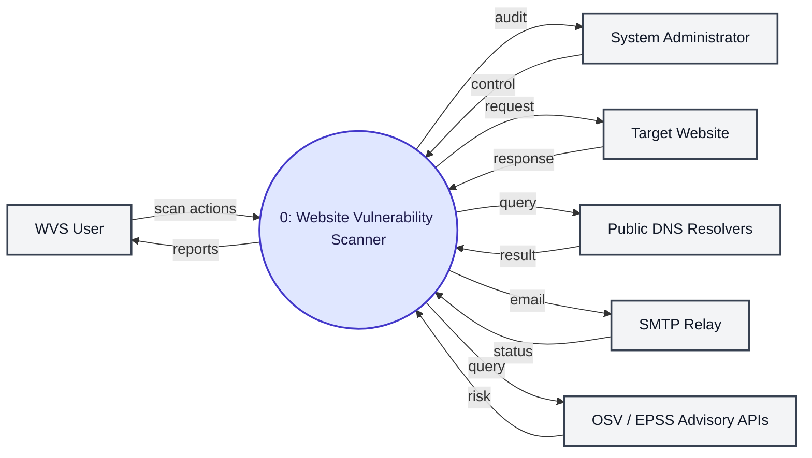

---

### 1.2 Level 1 DFD (Top-Level Functional Decomposition)

The Level 1 DFD decomposes Process 0 into 8 core functional subprocesses (`0.1` through `0.8`), explicitly depicting the sequential main scanning pipeline, third-party integrations, and central Scope Guard enforcement.

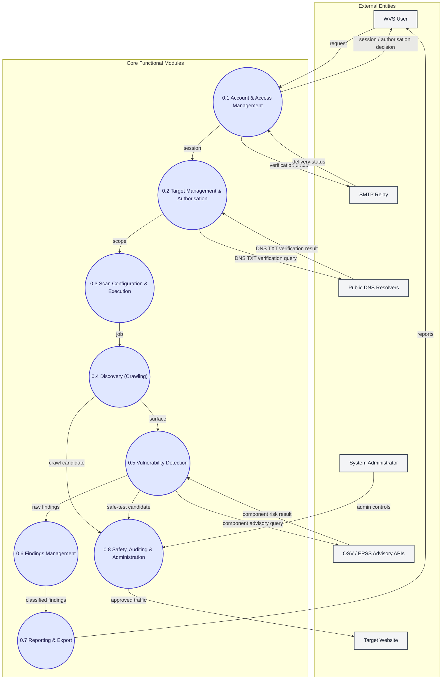

---

### 1.3 Level 2 DFDs

#### 1.3.1 F.1 User Authentication & Access Control

Decomposes Process `0.1` into credential validation, session issuance, and login auditing.

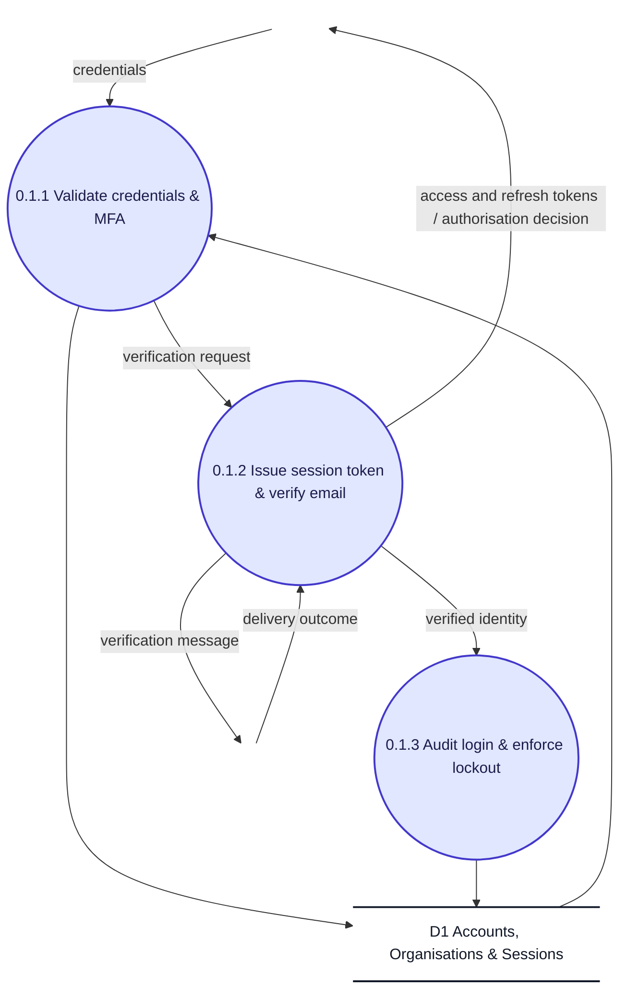

---

#### 1.3.2 F.2 Target Management & Authorisation

Decomposes Process `0.2` into target registration, verification token generation, and DNS/well-known ownership verification.

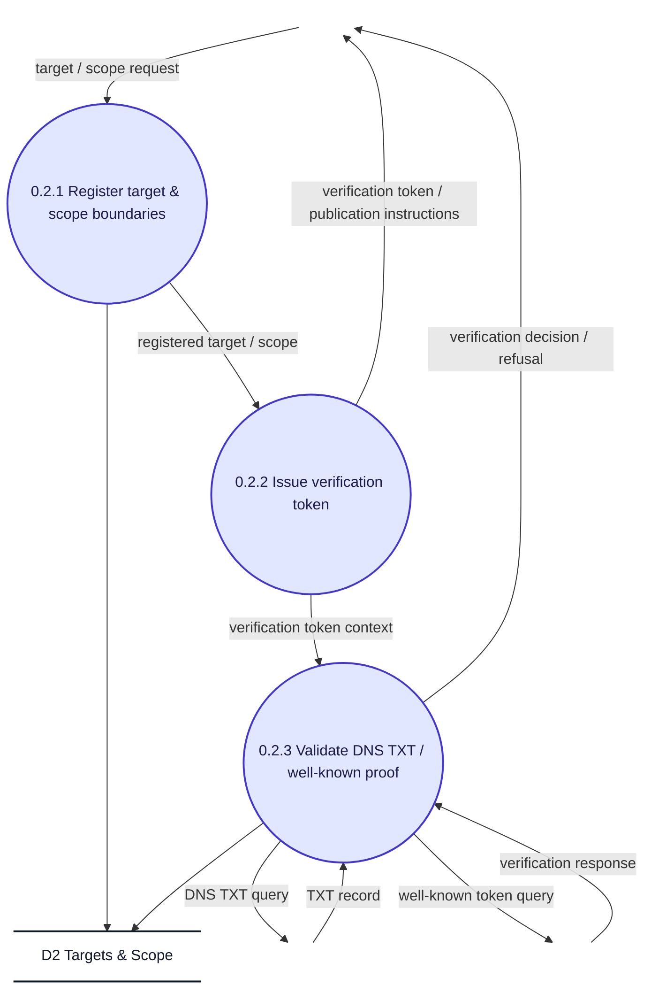

---

#### 1.3.3 F.3 Scan Configuration & Execution

Decomposes Process `0.3` into profile validation, job queuing, and lifecycle execution.

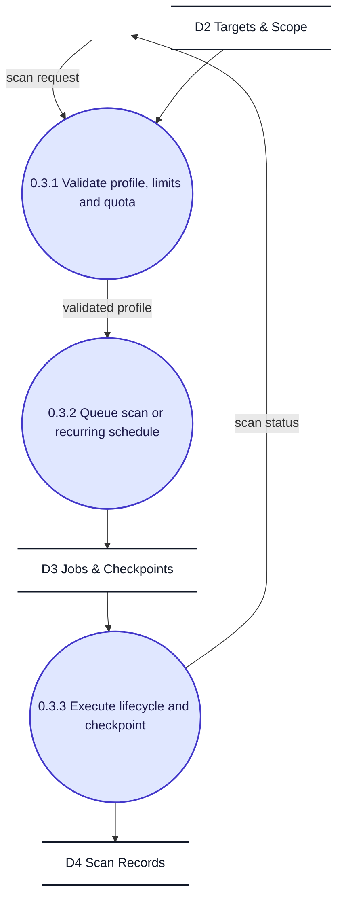

---

#### 1.3.4 F.4 Discovery (Crawling)

Decomposes Process `0.4` into scope loading, link discovery, and JS rendering deduplication with strict Scope Guard enforcement.

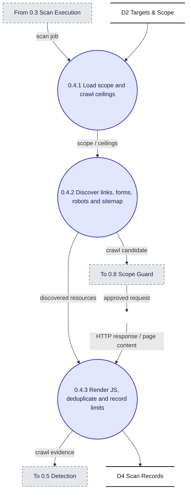

---

#### 1.3.5 F.5 Vulnerability Detection

Decomposes Process `0.5` into passive response checking, safe active check planning, and advisory version enrichment.

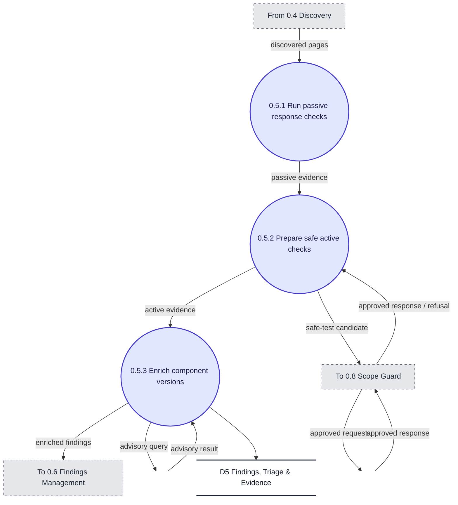

---

#### 1.3.6 F.6 Findings Management

Decomposes Process `0.6` into normalisation/redaction, historical scan comparison, and triage/filtering.

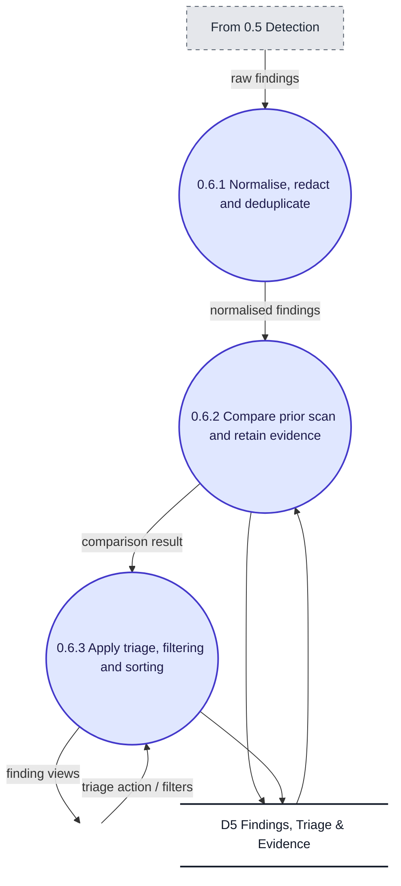

---

#### 1.3.7 F.7 Reporting & Export

Decomposes Process `0.7` into completed scan selection, report template assembly, and export/notification generation.

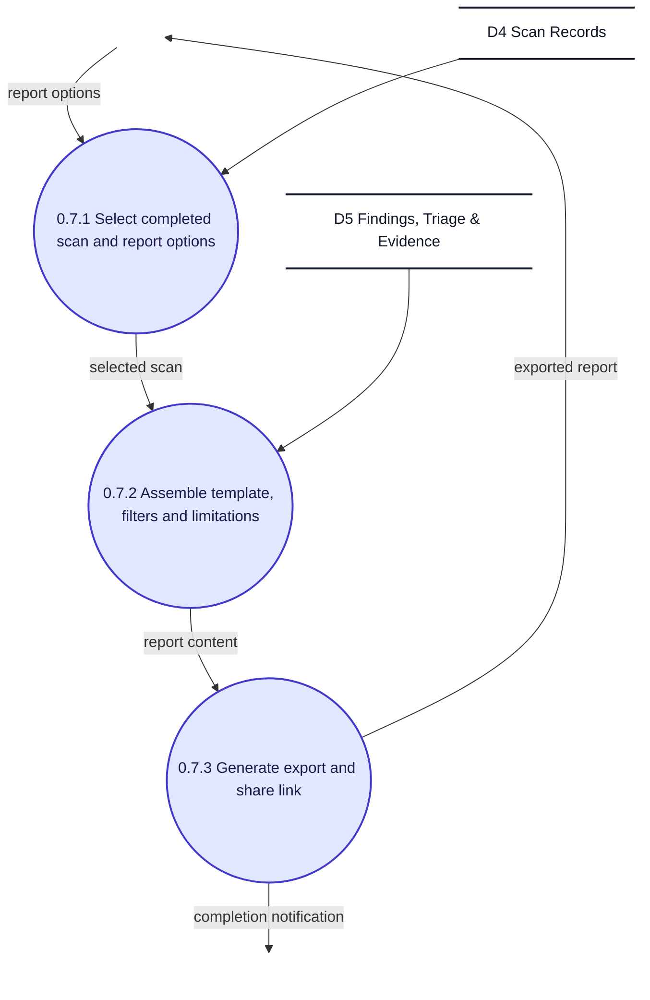

---

#### 1.3.8 F.8 Safety, Auditing & Administration

Decomposes Process `0.8` into verification/blocklist policy checking, DNS re-resolution & rate limiting, and request dispatch with append-only audit recording.

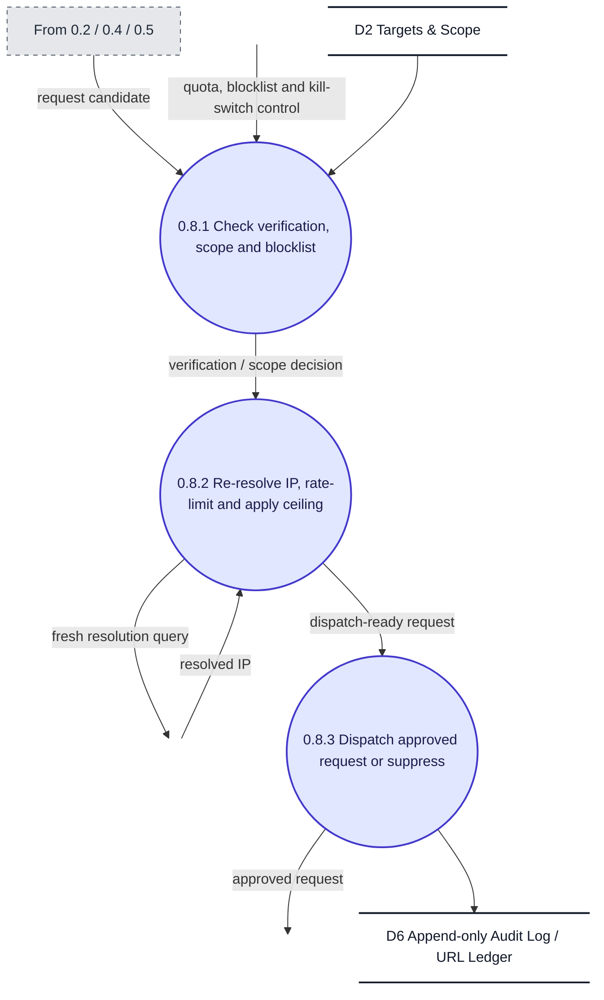

---

## 2. Data Dictionary

A single, consolidated data dictionary covering the data stores and principal data flows appearing across all DFDs in Section 1 (Level 0 through Level 2). Composition operators used: `+` (composition), `[ , ]` (selection), `( )` (optional data), `{ }` (iteration), `=` (equivalence), and `/* */` (comment).

### 2.1 Data Stores

| Data Store | Definition |
| :--- | :--- |
| **D1** Accounts, Organisations & Sessions | accounts-store = {username + email + password-hash + MFA-status + organisation-membership + session-token + failed-login-count}* |
| **D2** Targets & Scope | targets-store = {target-domain + verified-IP-ranges + path-inclusion-rules + path-exclusion-rules + ownership-verification-token + scan-ceiling}* |
| **D3** Jobs & Checkpoints | jobs-store = {scan-job + worker-assignment + execution-state + pause-checkpoint + cron-trigger}* |
| **D4** Scan Records | scan-records = {scan-metadata + crawled-page-inventory + HTTP-request-headers + HTTP-response-headers + crawl-limits}* |
| **D5** Findings, Triage & Evidence | findings-store = {vulnerability-record + CVSS-score + request-payload + response-payload + triage-state + comparison-metadata}* |
| **D6** Append-only Audit Log / URL Ledger | audit-log = {outbound-request-record + timestamp + scope-guard-evaluation + kill-switch-event}* /* immutable, append-only */ |

### 2.2 Data Flows

| Data Flow | Definition / Composition |
| :--- | :--- |
| `request` | request = [login-credentials, session-refresh-request] |
| `session` | session = session-token + organisation-permission-context |
| `scope` | scope = verified-target + path-boundaries + scan-authorisation |
| `job` | job = validated-scan-profile + schedule |
| `surface` | surface /* attack surface */ = {discovered-URL + forms + headers + JS-assets}* |
| `raw findings` | raw-findings = {vulnerability-candidate + request-payload + response-payload}* |
| `classified findings` | classified-findings = {normalised-finding + severity + triage-state}* |
| `reports` | reports = [pdf-report, html-report, json-export, csv-export, sarif-report] + (share-link) |
| `crawl candidate` | crawl-candidate = HTTP-request /* pending Scope Guard check */ |
| `safe-test candidate` | safe-test-candidate = active-test-payload /* pending Scope Guard check */ |
| `approved traffic` | approved-traffic = validated-HTTP-request /* dispatched within allowed rate limits */ |

### 2.3 Primitive Data Item Types

| Primitive | Type |
| :--- | :--- |
| username, email | string |
| password-hash | string /* stored only as a salted hash, never in plaintext */ |
| session-token | string /* JWT */ |
| timestamp | datetime |
| severity | [info, low, medium, high, critical] |
| triage-state | [open, confirmed, false-positive, accepted-risk, resolved] |
| scan-ceiling | integer /* maximum pages/requests per scan */ |
| HTTP-request, HTTP-response | {byte}* |

---

## 3. Structure Charts

### 3.1 Level 1 Structure Chart

The structure chart is derived from the Level 1 and Level 2 DFDs using the structured design approach of Rajib Mall. The user-facing request routing is factored by transaction analysis into one action module per transaction path, and the scan pipeline (0.3 → 0.4 → 0.5 → 0.6) is factored by transform analysis into an afferent branch, a transform centre, and an efferent branch. The Scope Guard modules (0.8) appear as shared library modules, with control couples (dotted arrows) carrying decisions such as approved/refused and lockout. Every data couple is labelled with the exact flow name used in the DFDs of Section 1 and defined in the data dictionary of Section 2, and points in the direction the data travels. The resulting module hierarchy is shown below.

### 3.2 Structure Chart

```mermaid
%%{init: {'flowchart': {'nodeSpacing': 50, 'rankSpacing': 80, 'padding': 18}}}%%
flowchart TD
    MAIN["WVS Main Controller"]
    INP["Obtain User Request"]
    ROUTE["Analyse Request Type (Transaction Centre)"]

    MAIN -->|"request"| INP
    INP -->|"request"| ROUTE

    T1["Handle Authentication (0.1)"]
    T2["Handle Target Management (0.2)"]
    T3["Handle Scan Launch & Execution (0.3)"]
    T4["Handle Findings Review (0.6)"]
    T5["Handle Report Export (0.7)"]
    T6["Handle Admin Safety Control (0.8)"]

    ROUTE -->|"credentials"| T1
    T1 -->|"session / authorisation decision"| ROUTE
    ROUTE -->|"target / scope request"| T2
    T2 -->|"verification decision / refusal"| ROUTE
    ROUTE -->|"scan request"| T3
    T3 -->|"scan status"| R_SC[" "]:::boundary
    R_SC --> ROUTE
    ROUTE -->|"triage action / filters"| T4
    T4 -->|"finding views"| ROUTE
    ROUTE -->|"report options"| T5
    T5 -->|"exported report"| ROUTE
    ROUTE -->|"admin controls"| T6

    subgraph AuthChildren[" "]
        A11["Validate Credentials & MFA (0.1.1)"]
        A12["Issue Session Token & Verify Email (0.1.2)"]
        A13["Audit Login & Enforce Lockout (0.1.3)"]
    end
    T1 -->|"credentials"| A11
    T1 -->|"verification request"| A12
    T1 -->|"verified identity"| A13
    A13 -.->|"lockout flag"| T1

    subgraph TargetChildren[" "]
        A21["Register Target & Scope (0.2.1)"]
        A22["Issue Verification Token (0.2.2)"]
        A23["Validate DNS TXT / Well-known Proof (0.2.3)"]
    end
    T2 -->|"target / scope request"| A21
    T2 -->|"registered target / scope"| A22
    T2 -->|"verification token context"| A23
    A23 -.->|"verification decision / refusal"| T2

    T3 -->|"scan request"| A31["Validate Profile, Limits & Quota (0.3.1)"]
    A31 -->|"validated profile"| A32["Queue Scan / Schedule (0.3.2)"]
    A32 -->|"job"| A33["Execute Scan Lifecycle & Checkpoint (0.3.3)"]

    subgraph Afferent ["Afferent branch (incoming flow)"]
        AFF["Discover Attack Surface"]
        A41["Load Scope & Crawl Ceilings (0.4.1)"]
        A42["Discover Links, Forms, robots & Sitemap (0.4.2)"]
        A43["Render JS, Deduplicate & Record Limits (0.4.3)"]
    end

    subgraph TransformCentre ["Transform centre"]
        TRC["Detect Vulnerabilities"]
        A51["Run Passive Response Checks (0.5.1)"]
        A52["Prepare Safe Active Checks (0.5.2)"]
        A53["Enrich Component Versions (0.5.3)"]
    end

    subgraph Efferent ["Efferent branch (outgoing flow)"]
        EFF["Classify & Manage Findings"]
        A61["Normalise, Redact & Deduplicate (0.6.1)"]
        A62["Compare Prior Scan & Retain Evidence (0.6.2)"]
        A63["Apply Triage, Filtering & Sorting (0.6.3)"]
    end

    A33 -->|"scan job"| AFF
    AFF -->|"surface"| TRC
    TRC -->|"raw findings"| EFF

    AFF -->|"scan job"| A41
    AFF -->|"scope / ceilings"| A42
    AFF -->|"discovered resources"| A43

    TRC -->|"discovered pages"| A51
    TRC -->|"passive evidence"| A52
    TRC -->|"active evidence"| A53

    EFF -->|"raw findings"| A61
    EFF -->|"normalised findings"| A62
    EFF -->|"comparison result"| A63

    subgraph SafetyLibrary ["Common safety modules — Scope Guard (0.8)"]
        SG1[["Check Verification, Scope & Blocklist (0.8.1)"]]
        SG2[["Re-resolve IP, Rate-limit & Apply Ceiling (0.8.2)"]]
        SG3[["Dispatch Approved Request & Record Audit Trail (0.8.3)"]]
    end

    A42 -->|"crawl candidate"| SG1
    A52 -->|"safe-test candidate"| SG1
    SG1 -->|"verification / scope decision"| SG2
    SG2 -->|"dispatch-ready request"| SG3
    SG3 -.->|"approved response / refusal"| A42
    SG3 -.->|"approved response / refusal"| A52
    T6 -.->|"quota, blocklist and kill-switch control"| SG1

    subgraph ReportChildren[" "]
        A71["Select Completed Scan & Options (0.7.1)"]
        A72["Assemble Template, Filters & Limitations (0.7.2)"]
        A73["Generate Export, Share Link & Notify (0.7.3)"]
    end
    T5 -->|"report options"| A71
    T5 -->|"selected scan"| A72
    T5 -->|"report content"| A73

    T4 -->|"triage action / filters"| A63

    subgraph Legend ["Legend"]
        LG1["Module"]
        LG2[["Library module (shared)"]]
        LG3["Receiving module"]
        LG1 -->|"call — data couple (direction of data)"| LG3
        LG1 -.->|"control couple"| LG3
        LG1 -->|"call"| LG2
    end

    classDef top fill:#1e1b4b,stroke:#0f172a,stroke-width:2px,color:#ffffff;
    classDef txcentre fill:#312e81,stroke:#1e1b4b,stroke-width:2px,color:#ffffff;
    classDef branch fill:#c7d2fe,stroke:#4338ca,stroke-width:2px,color:#1e1b4b;
    classDef leaf fill:#e0e7ff,stroke:#4338ca,stroke-width:2px,color:#1e1b4b;
    classDef lib fill:#fef3c7,stroke:#b45309,stroke-width:2px,color:#431407;
    classDef legend fill:#f3f4f6,stroke:#374151,stroke-width:1px,color:#111827;
    classDef boundary fill:transparent,stroke:transparent,color:transparent;

    class MAIN top;
    class ROUTE txcentre;
    class INP,T1,T2,T3,T4,T5,T6,AFF,TRC,EFF branch;
    class A11,A12,A13,A21,A22,A23,A31,A32,A33,A41,A42,A43,A51,A52,A53,A61,A62,A63,A71,A72,A73 leaf;
    class SG1,SG2,SG3 lib;
    class LG1,LG2,LG3 legend;

    style Afferent fill:#f8fafc,stroke:#64748b,stroke-width:1px,stroke-dasharray:6 4,color:#334155;
    style TransformCentre fill:#eef2ff,stroke:#4338ca,stroke-width:1px,stroke-dasharray:6 4,color:#312e81;
    style Efferent fill:#f8fafc,stroke:#64748b,stroke-width:1px,stroke-dasharray:6 4,color:#334155;
    style SafetyLibrary fill:#fffbeb,stroke:#b45309,stroke-width:1px,stroke-dasharray:6 4,color:#78350f;
    style Legend fill:transparent,stroke:#9ca3af,stroke-width:1px,stroke-dasharray:4 4,color:#4b5563;
    style AuthChildren fill:transparent,stroke:transparent,stroke-width:0px,color:transparent;
    style TargetChildren fill:transparent,stroke:transparent,stroke-width:0px,color:transparent;
    style ReportChildren fill:transparent,stroke:transparent,stroke-width:0px,color:transparent;
```
